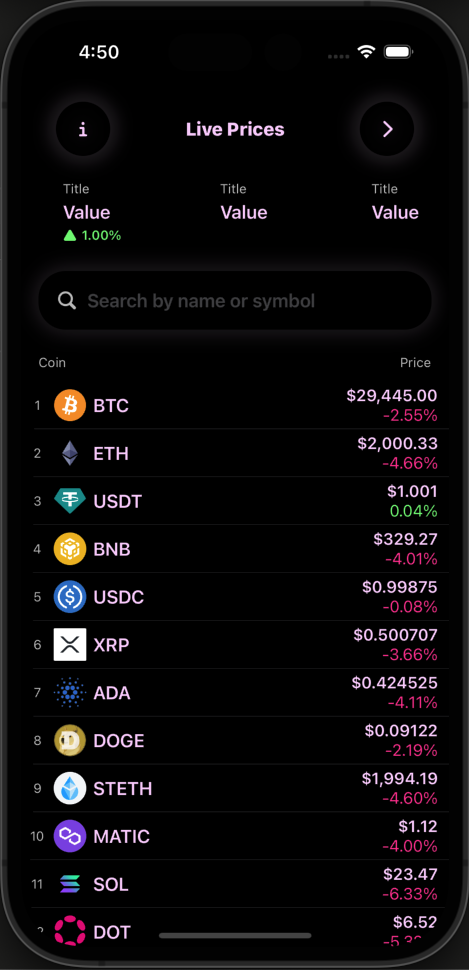

# FusionCrypt

A crypto currency app that provides all information about the hottest crypto currencies in the market

## Technical Points

- SwiftUI declarative UI
- Color schemes for light and dark mode
- SwiftUI Animations
- CoinGecko Crypto Currency API, Data model generation with quicktype, Codable, CodingKeys
- Number and string formatting
- Design Patterns: MVVM, singleton, extensions
- Use a service layer publish/subscription model for coin data calls.
- Use a network utility class that encapsulate networking requests and error handling, error enums
- Combine framework: @Publish, ObservableObject, @StateObject, environment object, subscription, cancellable, combineLatest, map, reduce, compactMap, tryMap, sink
- Local persistence with FileManager
- Implement a search bar: HStack, overlay, onTapGesture, searchText @Binding, combine subscriptions, filter, debounce for performance
- Create market statistic view and download data from API, extend Double for formatting, map between data models object to list
- Create portfolio management sheet, dismiss sheet, ScrollView, NavigationView, toolbar, LazyHStack, withAnimation, onChange
- Core Data database: entity modeling for portfolio coins, CRUD operations: NSPersistentCotainer, container.viewContext, NSFetchReuqest
- Haptic feedback on reload operation with UINotificationFeedBackGenerator
- Enable sorting of coin list, improve performance by in-place sort with inout &ref
- Custom NavigationLink for lazy loading of coin DetailView

